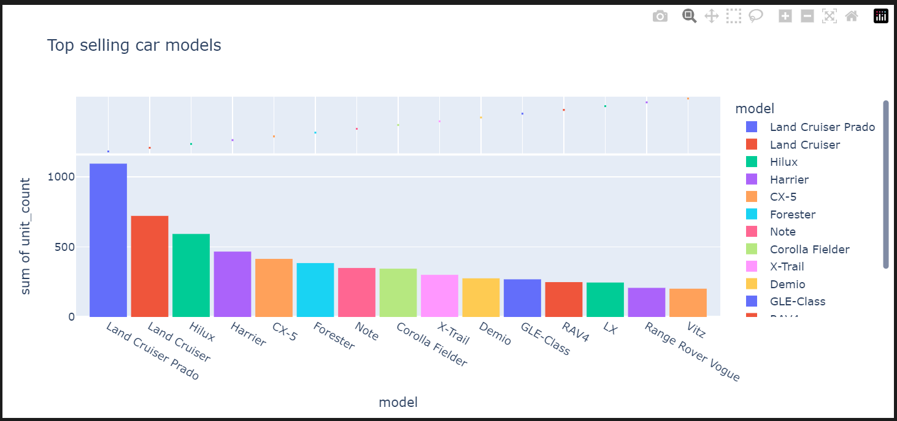
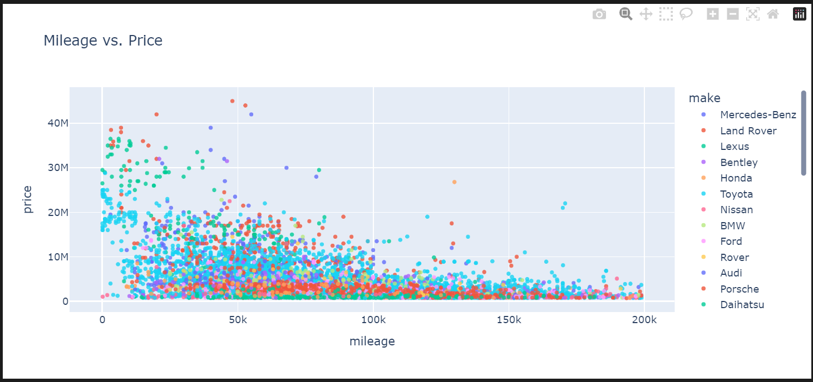

# Used-Cars-Depreciation-Analysis-and-Prediction

### Interact with the app [here](https://car-price-estimator-ke.streamlit.app/)

###  Project Overview

This project involves scraping and analyzing car listings from [Jiji.co.ke](https://jiji.co.ke/cars), one of Kenya's most popular online marketplaces. Using Selenium, we collected detailed car data, stored it in a PostgreSQL database, and used SQL and Python for data analysis and visualization. We also trained a machine learning model to predict car prices based on key features and deployed it using Streamlit for real-time predictions.

### Objectives

* Scrape detailed car listings from Jiji.co.ke
* Process and clean the data
* Store the scraped data in a structured PostgreSQL database
* Analyze key car market trends using SQL
* Visualize insights using Python (Pandas, Matplotlib, Seaborn)
* Train a machine learning model to predict car prices
* Deploy the prediction model with Streamlit for user interaction
* Provide actionable insights for car traders and buyers

### Key Research Questions

* What is the resale value of a specific car brand and model in Kenya?
* What are the most in-demand cars in specific regions?
* Is there a preferred price range that buyers are targeting?
* What regions or cities have the highest and lowest average car prices for a specific model?
* Which color variants are most common and do they influence car pricing?

### Data Collection

We used Selenium to extract data for each listing by following links from the car listings homepage. Each listing provided:

* Make, Model, Year * Price * Mileage * Transmission * Color * Condition * Location

###  Database Schema

The scraped data was stored in a PostgreSQL table called `listings`:

| Column Name  | Data Type |
| ------------ | --------- |
| make         | TEXT      |
| model        | TEXT      |
| year         | INTEGER   |
| price        | INTEGER   |
| mileage      | INTEGER   |
| transmission | TEXT      |
| color        | TEXT      |
| condition    | TEXT      |
| location     | TEXT      |
| listing_url  | TEXT      |

###  Findings and Insights

Based on SQL analysis of the collected data:

* **Toyota** is the most frequently listed brand, followed by **Nissan**.
* **Land Cruiser Prado** is the most commonly listed model.
* Listings with **lower mileage** generally have **higher prices**, regardless of brand.
* **Mombasa** has the highest number of listings, followed by **Nairobi**.
* **Foreign-used** cars dominate the market, followed by **locally used** and **brand new**.
* The most popular **car colors** are white, black, gray, and silver.
* Most cars are priced between **KSh 500,000 and KSh 5,000,000**, indicating a concentrated mid-range market.

### Machine Learning Model (Price Prediction)

We trained a machine learning model using `RandomForestRegressor` from `scikit-learn` to predict car prices based on the following features:

* Make * Model * Year
* Mileage * Transmission * Color * Condition * Location

### ML Pipeline

* Preprocessing: `ColumnTransformer` to handle categorical encoding and scaling
* Model training: Random forest with cross-validation
* Model evaluation: RMSE and R² metrics
* Final model exported as `model_pipeline.pkl`

### Deployment with Streamlit

We deployed the trained ML model using Streamlit to provide a real-time car price prediction tool. The interface allows users to input details of a car and receive a predicted price based on the model.

#### To Run the App Locally:

1. Install requirements:

   ```bash
   pip install -r requirements.txt
   ```

2. Run the Streamlit app:

   ```bash
   streamlit run app.py
   ```

### Business Implications

#### For Sellers:

* Focus on high-demand brands like Toyota and Nissan for quicker sales.
* Sourcing foreign-used vehicles, especially Land Cruiser Prados, can yield higher margins.
* List vehicles in Mombasa for greater visibility or target Nairobi for premium pricing.
* Highlight low mileage in listings to justify higher pricing.
* Stick to neutral colors (white, black, gray) to meet buyer preferences.
* Price vehicles within the KSh 500k–5M range to appeal to the majority of buyers.

#### For Buyers:

* Be prepared to pay a premium for low-mileage and foreign-used cars.
* Compare prices between Mombasa and Nairobi for better deals.
* Consider common brands for easier maintenance and resale.
* Buying a high-end unit will guarantee you a higher resale value, especially German cars.
* Japanese cars are affordable and easy to maintain because of readily available maintenance parts.

### Visualizations

### Top Car Brands by Listing Frequency







### Tools Used

* **Selenium** for scraping
* **PostgreSQL** for storage
* **SQL** for analysis
* **Pandas, Matplotlib, Seaborn** for visualization
* **scikit-learn** for ML modeling
* **Streamlit** for deployment

### How to Run This Project

1. Clone the repository
2. Run the scraper script (`scraper.ipynb`) with Selenium
3. Merge, clean, and load the data into the PostgreSQL `Vehicle Database` using `data_processing.ipynb`
4. Use `analysis.sql` for SQL queries
5. Run `visualizations.ipynb` for charts and graphs
6. Train the model using `ml_model_training.ipynb`
7. Run the Streamlit app with `streamlit run app.py`

### Future Enhancements

* Improve model accuracy with advanced techniques like XGBoost or stacking
* Add image-based price prediction using computer vision
* Build an interactive dashboard with user filtering
* Integrate live scraping for real-time market updates
